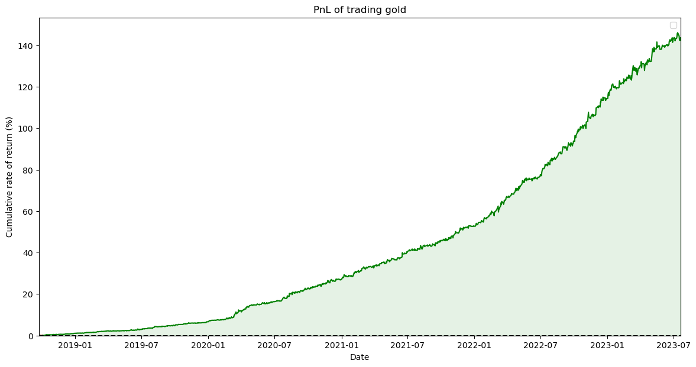

# ARIMA-Based Gold Price Forecasting & Trading Strategy

## Overview

This project implements a time series forecasting and algorithmic trading system based on the ARIMA model. 
It predicts next-day gold prices using historical data and generates long or short trading signals based on the direction of the forecast. 
The performance of the strategy is evaluated by backtesting it on unseen historical data.

## Methodology

### Data Processing

The dataset consists of daily gold prices from 2010 onwards, sourced from [Kaggle](https://www.kaggle.com/datasets/rizkykiky/gold-price-dataset). 
The time series is preprocessed by cleaning missing values, converting the date column into a proper time index, and applying time series decomposition to extract the underlying trend component. 
The final dataset is split into training and testing sets, with the last five years reserved for backtesting.

### Forecasting Model

The forecasting model is uses an ARIMA model. 
The optimal model parameters are selected using the `auto_arima` function, which minimises information criteria such as AIC and BIC. 
A walk-forward forecasting approach is used, where the model is updated iteratively with each new observation without full retraining. 
This allows the model to generate one-step-ahead forecasts for each trading day in the test period.

### Trading Strategy

The trading strategy is based on the direction of the forecasted price movement. 
A long position is taken when the predicted price is higher than the previous close, while a short position is taken otherwise, taking into account transaction costs of 0.5%. 
The simulation begins with an initial capital of USD 1 mil.
We enter the first trade with 10% of initial capital, and use that cumulative capital to trade.
(As a simplified model, when we change position from long to short, we cash out all our shares and exit the market, then enter the market and take a short position using the same amount of cash.)

Let $\Delta p$ be the expected price change (in percentage), $t$ denote transaction cost (in percentage).

If current position is long:
- If predict price increase ($\Delta p\ge 0$), then hold since any price increase results in pure profit without incurring transaction costs. Profit = $\Delta p$.
- If predict price decrease ($\Delta p<0$), 
    - If hold, then we incur loss of price decrease. Net profit = $\Delta p<0$.
    - If exit, then we incur loss of transaction costs. Net profit = $-t<0$.
    - If flip to short, then we incur loss of 2x transaction costs, gain of price decrease. Net profit = $-\Delta p-2t$.

    Compare $\Delta p, -t, -\Delta p-2t$, and take the position that yields the largest net profit.

    (Note that in this model, we will not exit only. For a contradiction, suppose we only exit. This means $-t>\Delta p$ and $-t>-\Delta p-2t$, so $t<-\Delta p$ and $t>-\Delta p$, which is absurd.)

If current position is short:
- If predict price decrease ($\Delta p\le 0$), then continue to short since any price decrease results in pure profit without incurring transaction costs. Profit = $-\Delta p$.
- If predict price increase ($\Delta p>0$), 
    - If hold, then we incur loss of price increase. Net profit = $-\Delta p<0$.
    - If exit, then we incur loss of transaction costs. Net profit = $-t<0$.
    - If flip to long, then we incur loss of 2x transaction costs, gain of price increase. Net profit = $\Delta p-2t$.

    Compare $-\Delta p, -t, \Delta p-2t$, and take the position that yields the largest net profit.

    (Similar to the analysis above, we will not exit only.)

If current position is not in a trade:
- If predict price increase ($\Delta p>0$), buy if $\Delta p>t$, profit = $\Delta p-t$; else don't enter.
- If predict price decrease ($\Delta p<0$), sell if $-\Delta p>t$, profit = $-\Delta p-t$; else don't enter.

A long position, short position, and no position are denoted as 1, -1, 0 respectively. 

### Backtesting Results

The results of backtesting the strategy are summarised below:

| Metric | Result |
| --- | --- | 
| Annualised rate of return | 28.74% |
| Win rate | 57.51% |
| Average win/loss ratio | 1.23 |
| Profit factor | 1.85 |
| Sharpe ratio | 2.90|

## Notes

No slippage is included in the simulation. 
As a result, the reported performance reflects an idealised backtest environment. 
The strategy is based purely on historical data, and its performance may not generalise to live trading conditions.
